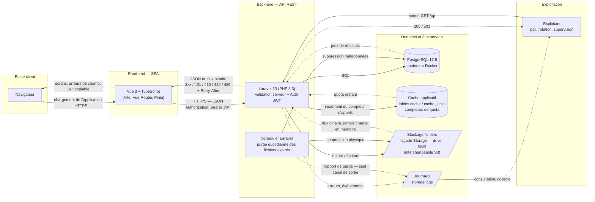
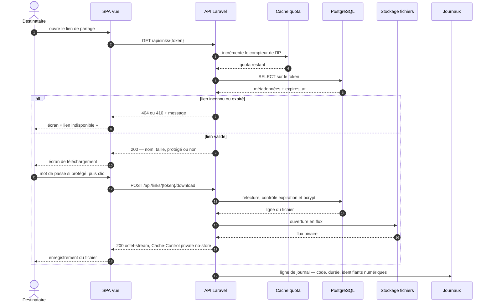

# Architecture de la solution — DataShare

## Composants et flux

**Trait plein** : appel sortant, celui qui déclenche le traitement.
**Trait pointillé** : information qui remonte. Les deux sens circulent sur la
même connexion HTTP côté client ; côté exploitation, l'aller et le retour
empruntent des chemins distincts, ce qui est précisément l'objet de la section
suivante.

## Légende et flux

| Élément | Rôle |
| --- | --- |
| SPA Vue 3 + TS | Interface utilisateur (maquettes Figma), validation côté client |
| API Laravel | Logique métier, validation côté serveur, émission/vérification JWT |
| PostgreSQL | Métadonnées : utilisateurs, fichiers (token, expiration, protection) |
| Cache applicatif | Compteurs de quota du limiteur de débit ; aucune donnée métier |
| Stockage fichiers | Contenu binaire, noms physiques aléatoires, hors racine web |
| Journaux | Seule sortie des traitements sans client : purge, erreurs, quotas |
| Scheduler | Tâche planifiée quotidienne : suppression des fichiers expirés (métadonnées + physique) |

Sécurisation des échanges : HTTPS de bout en bout, JWT en en-tête `Authorization`
sur les routes protégées, validation des entrées côté client **et** serveur,
mots de passe (comptes et fichiers) hachés en bcrypt.

## Comment l'information remonte

Trois canaux de retour, de natures différentes, qu'il ne faut pas confondre :

| Canal | Destinataire | Synchrone ? | Contenu |
| --- | --- | --- | --- |
| Réponse HTTP | La SPA, donc l'utilisateur | Oui, même connexion | Code de statut, corps JSON ou flux binaire, en-têtes |
| Journaux | L'exploitant | Non | Erreurs, rapport de purge, dépassements de quota |
| Sondes | La supervision | Oui, à la demande | `GET /up`, `GET /api/ping` |

Le point important est qu'aucun de ces canaux n'est redondant : **le scheduler
n'a pas de client**. Une purge qui échoue — ou qui ne tourne pas du tout, faute
d'entrée cron — ne provoque aucune réponse HTTP et reste donc invisible tant
qu'on ne lit pas les journaux. C'est la seule remontée dont il dispose.

### Le sens du code de statut

Côté API, l'information remonte d'abord par le code, pas par le corps. Le
contrat ([openapi.yaml](openapi.yaml)) en fait une grammaire :

| Code | Ce qu'il apprend au client |
| --- | --- |
| `201` / `200` / `204` | Traitement accepté ; le corps porte la ressource, ou rien |
| `401` | Jeton absent, invalide ou expiré — ou mot de passe de partage incorrect |
| `403` | Le fichier appartient à un autre utilisateur |
| `404` | Lien inconnu — indistinguable, volontairement, d'un lien jamais émis |
| `410` | Lien connu mais expiré : l'information « il a existé » est assumée |
| `422` | Validation serveur ; le corps détaille les erreurs, champ par champ |
| `429` | Quota dépassé ; `Retry-After` indique l'attente en secondes |

Le `422` est le cas le plus visible aujourd'hui : c'est lui qui alimente les
messages sous les champs du formulaire d'inscription. Le front n'invente aucun
libellé d'erreur métier, il affiche ce que le serveur lui remonte.

Deux valeurs remontent calculées côté serveur plutôt que déduites côté client :
`expired` (comparaison de `expires_at` à l'instant du serveur) et `protected`
(présence d'un mot de passe, jamais le mot de passe lui-même). Un navigateur à
l'horloge fausse ne doit pas pouvoir se croire dans les temps.

### Parcours de téléchargement, aller et retour

L'expiration est revérifiée au téléchargement et pas seulement à l'affichage :
entre les deux appels, le lien a pu échoir. La vérification qui compte est
toujours la dernière, celle qui précède immédiatement l'ouverture du flux.

## Cache

### Ce qui est en place

Le store est configuré sur `database` (`CACHE_STORE`), soit les tables `cache`
et `cache_locks` du même PostgreSQL. Son unique consommateur à ce jour est le
**limiteur de débit** : 60 appels par minute sur `/api`, 5 sur `/api/auth/*`.
Les compteurs y vivent le temps d'une fenêtre ; c'est de là que sortent le `429`
et son `Retry-After`.

Au déploiement s'y ajoutent les caches de compilation du framework
(`config:cache`, `route:cache`, `event:cache`) : ils figent la configuration et
la table de routage en un fichier PHP unique, ce qui évite de relire et
fusionner une trentaine de fichiers à chaque requête. Ce sont des caches de
**code**, pas de données — à ne pas confondre avec un cache de réponses.

Côté front, la mise en cache est déléguée au navigateur et repose sur le
nommage : Vite produit des noms de fichiers hachés, donc immuables, ce qui
autorise un `Cache-Control: immutable` de longue durée sur les assets et les
polices auto-hébergées, avec un `index.html` en `no-cache` comme seul point
d'entrée à revalider. Une nouvelle version change les noms, jamais le contenu
d'un nom déjà servi.

### Ce qui n'est délibérément pas mis en cache

Aucune réponse d'API ne l'est, et c'est une décision, pas un oubli :

- **Les réponses dépendent du temps.** `expired` se calcule contre `now()`. Une
  réponse mise en cache, même une minute, continuerait d'annoncer disponible un
  lien déjà échu — et ruinerait la garantie d'inaccessibilité immédiate
  décrite plus bas.
- **Elles dépendent de l'identité.** L'historique est celui du porteur du
  jeton ; un cache partagé exposerait les fichiers d'autrui.
- **Le contenu téléchargé doit porter `Cache-Control: private, no-store`.** Un
  proxy ou un CDN qui en garderait une copie servirait le fichier sans repasser
  par le contrôle d'expiration ni par le mot de passe (US09) : exactement ce que
  le choix « fichiers hors racine web » cherche à empêcher. Le cache est ici un
  risque de sécurité avant d'être un gain de performance.

Le vrai levier de performance du projet n'est donc pas le cache mais le
**streaming** : un fichier de 1 Go est lu et écrit en flux, jamais chargé en
mémoire PHP. Les index de la base (cf. [mcd.md](mcd.md)) font le reste, la
recherche par token étant le seul accès à fort volume.

### Limites assumées et voie de production

Le pilote `database` fait un aller-retour SQL par requête pour le seul compteur
de quota : acceptable pour un prototype, discutable sous charge. Le passage à
`redis` se fait par variable d'environnement, sans toucher au code — c'est
d'ailleurs la raison d'être de l'abstraction `Cache` de Laravel.

Une entrée expirée est ignorée à la lecture et supprimée à cette occasion ;
celles que plus personne ne relit — le compteur d'une adresse IP vue une seule
fois — subsistent dans la table. À surveiller si le volume croît ; `cache:clear`
la vide sans effet de bord, puisqu'elle ne contient aucune donnée métier.

## Journalisation et supervision

### État actuel

`LOG_CHANNEL=stack` réduit à un seul canal `single`, soit
`storage/logs/laravel.log`, au niveau `debug`. En développement, `php artisan
pail` suit ce flux en direct. Rien n'est encore journalisé explicitement par le
code métier : ce qu'on y lit est ce que Laravel y écrit seul, principalement les
exceptions non rattrapées.

### Ce qui doit y être écrit

Trois familles d'événements, retenues parce qu'elles n'ont **aucun autre canal
de remontée** :

- **Le rapport de purge** : nombre de fichiers supprimés, échecs de suppression
  physique. Sans lui, un scheduler qui ne tourne pas est indétectable jusqu'à
  saturation du disque.
- **Les échecs d'authentification et les `429`** : pris isolément ce sont des
  réponses normales ; leur concentration signale un bourrage d'identifiants ou
  une énumération de comptes.
- **Les erreurs 5xx**, avec le contexte nécessaire au diagnostic — le client,
  lui, ne reçoit qu'un message générique.

### Ce qui ne doit jamais y entrer

- **Le token d'un lien de partage.** C'est un secret porteur : qui lit le
  journal télécharge le fichier. Même remarque pour le JWT.
- **Les mots de passe**, de compte comme de partage, y compris dans les données
  de requête d'une exception.
- **Les adresses électroniques et les noms de fichiers d'origine** : données
  personnelles, dont un journal conservé plusieurs jours devient un traitement à
  part entière. On journalise l'identifiant numérique de l'utilisateur ou du
  fichier, jamais sa valeur parlante.

Corollaire d'exploitation : `APP_DEBUG` doit passer à `false` en production. À
`true`, une trace d'exception part dans la réponse HTTP, paramètres de requête
compris — le contenu qu'on vient d'exclure des journaux ressortirait par le
canal client.

### Configuration cible

Le canal se choisit par variable d'environnement, sans toucher au code :
`daily` avec rotation (`LOG_DAILY_DAYS=14`) sur un serveur classique, `stderr`
si le back-end tourne en conteneur, pour que la plateforme d'hébergement
collecte le flux. Le niveau descend à `warning` : `debug` en production
inscrirait le détail des requêtes, donc les données que la section précédente
exclut.

La disponibilité, elle, se lit sur `GET /up`, déclarée au niveau du bootstrap et
distincte de `GET /api/ping` : la première boote l'application, la seconde ne
répond que si le routage `/api` fonctionne.

## Décisions de conception

- **SPA et API séparées plutôt que rendu serveur (Blade/Inertia)** : les
  maquettes décrivent un parcours à état — barre de progression d'upload,
  compte à rebours d'expiration, copie du lien — qui suppose de toute façon du
  JavaScript côté client. Une API REST rend en outre le back-end réutilisable
  par un autre client (mobile, CLI) sans refonte.
- **Authentification par JWT plutôt que session à cookie** : l'API reste sans
  état, donc horizontalement extensible, et le front est libre de son
  hébergement (pas de contrainte de domaine partagé pour le cookie). Le prix à
  payer : un jeton émis ne peut pas être révoqué avant son échéance — d'où une
  durée de vie courte (60 minutes par défaut), et l'obligation de vérifier
  l'existence du compte à chaque requête plutôt que de faire confiance au seul
  contenu du jeton.
- **Fichiers hors de la racine web, servis par un contrôleur** : c'est ce qui
  rend les règles métier incontournables. Un fichier accessible par URL directe
  contournerait la vérification d'expiration et le mot de passe de partage
  (US09) ; en passant systématiquement par l'application, un lien reste
  inopérant dès `expires_at` dépassé, avant même toute suppression.
- **Façade `Storage` plutôt qu'un accès direct au système de fichiers** :
  le driver `local` suffit au prototype, et le passage à S3 se fait par
  configuration, sans toucher au code métier. Le même contrat couvre l'écriture,
  la lecture en flux et la suppression, ce dont la purge a besoin.
- **Validation dupliquée client et serveur** : côté client pour le retour
  immédiat exigé par les maquettes, côté serveur parce que c'est la seule
  barrière réelle — l'API est atteignable sans passer par la SPA.
- **bcrypt pour les deux usages de mot de passe** : algorithme à coût
  paramétrable, hachage natif de Laravel, et aucun besoin de déchiffrement
  (comptes comme partages ne font que vérifier).

## Ce que garantit — et ne garantit pas — le scheduler

L'expiration et la purge sont deux mécanismes distincts, volontairement
découplés :

- **L'inaccessibilité est immédiate** et ne dépend pas du scheduler : elle
  découle du test `expires_at < now()` à chaque requête. Un lien cesse de
  fonctionner à la seconde près.
- **L'effacement physique est différé** au passage quotidien suivant. Un
  fichier expiré peut donc subsister sur le disque jusqu'à 24 h. Ce n'est pas
  une garantie d'effacement immédiat, et il faut l'assumer comme tel si une
  exigence de rétention plus stricte apparaît.

**Ordre des suppressions** : contenu physique d'abord, ligne en base ensuite.
Si la seconde étape échoue, le passage suivant retrouve la ligne expirée et
retente — la suppression d'un fichier déjà absent étant sans effet, la tâche
est rejouable sans dommage. L'ordre inverse laisserait un fichier orphelin sur
le disque, que plus aucune ligne ne référence et qu'aucun passage ne
retrouverait.

**Prérequis d'exploitation** : le scheduler Laravel suppose une entrée cron
appelant `schedule:run` chaque minute. Sans elle, aucune purge n'a lieu — les
liens expirent malgré tout, mais le disque ne se libère jamais.

## Périmètre du prototype

En développement, seul PostgreSQL est conteneurisé (`compose.yaml`) ; le
back-end tourne via `php artisan serve` et le front via Vite. HTTPS relève donc
de l'environnement de déploiement, pas du poste de développement — de même que
la rotation des journaux, le niveau de log de production et le choix du store de
cache, tous pilotés par variables d'environnement.

Ce document décrit l'architecture cible, celle du contrat d'API. À ce stade,
une seule des sept opérations est implémentée (`POST /api/auth/register`) : le
parcours de téléchargement schématisé plus haut est donc une conception, pas un
état des lieux. Le limiteur de débit, lui, est en place et opérant.
