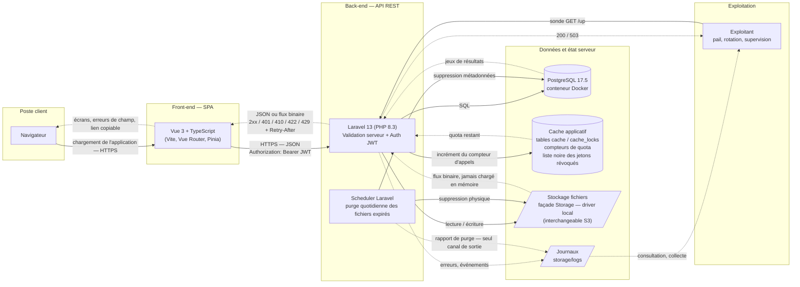
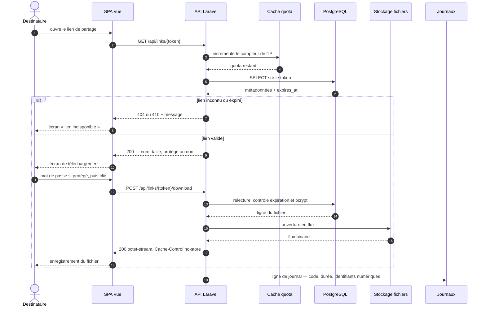

# Architecture de la solution — DataShare

## Composants et flux

**Trait plein** : appel sortant, celui qui déclenche le traitement.
**Trait pointillé** : information qui remonte. Les deux sens circulent sur la
même connexion HTTP côté client ; côté exploitation, l'aller et le retour
empruntent des chemins distincts, ce qui est précisément l'objet de la section
suivante.

## Légende et flux

| Élément | Rôle |
| --- | --- |
| SPA Vue 3 + TS | Interface utilisateur (maquettes Figma), validation côté client |
| API Laravel | Logique métier, validation côté serveur, émission/vérification JWT |
| PostgreSQL | Métadonnées : utilisateurs, fichiers (token, expiration, protection) |
| Cache applicatif | Compteurs de quota du limiteur de débit ; liste noire des jetons révoqués par la déconnexion |
| Stockage fichiers | Contenu binaire, noms physiques aléatoires, hors racine web |
| Journaux | Seule sortie des traitements sans client : purge, erreurs, quotas |
| Scheduler | Tâche planifiée quotidienne : suppression des fichiers expirés (métadonnées + physique) |

Sécurisation des échanges : HTTPS de bout en bout, JWT en en-tête `Authorization`
sur les routes protégées, validation des entrées côté client **et** serveur,
mots de passe (comptes et fichiers) hachés en bcrypt.

## Comment l'information remonte

Trois canaux de retour, de natures différentes, qu'il ne faut pas confondre :

| Canal | Destinataire | Synchrone ? | Contenu |
| --- | --- | --- | --- |
| Réponse HTTP | La SPA, donc l'utilisateur | Oui, même connexion | Code de statut, corps JSON ou flux binaire, en-têtes |
| Journaux | L'exploitant | Non | Erreurs, rapport de purge, dépassements de quota |
| Sondes | La supervision | Oui, à la demande | `GET /up`, `GET /api/ping` |

Le point important est qu'aucun de ces canaux n'est redondant : **le scheduler
n'a pas de client**. Une purge qui échoue — ou qui ne tourne pas du tout, faute
d'entrée cron — ne provoque aucune réponse HTTP et reste donc invisible tant
qu'on ne lit pas les journaux. C'est la seule remontée dont il dispose.

### Le sens du code de statut

Côté API, l'information remonte d'abord par le code, pas par le corps. Le
contrat ([openapi.yaml](openapi.yaml)) en fait une grammaire :

| Code | Ce qu'il apprend au client |
| --- | --- |
| `201` / `200` / `204` | Traitement accepté ; le corps porte la ressource, ou rien |
| `401` | Jeton absent, invalide, expiré ou révoqué — identifiants de connexion refusés, ou mot de passe de partage incorrect |
| `403` | Le fichier appartient à un autre utilisateur |
| `404` | Lien inconnu — indistinguable, volontairement, d'un lien jamais émis |
| `410` | Lien connu mais expiré : l'information « il a existé » est assumée |
| `422` | Validation serveur ; le corps détaille les erreurs, champ par champ |
| `429` | Quota dépassé ; `Retry-After` indique l'attente en secondes |

Le `422` est le cas le plus visible aujourd'hui : c'est lui qui alimente les
messages sous les champs du formulaire d'inscription. Le front n'invente aucun
libellé d'erreur métier, il affiche ce que le serveur lui remonte.

Deux valeurs remontent calculées côté serveur plutôt que déduites côté client :
`expired` (comparaison de `expires_at` à l'instant du serveur) et `protected`
(présence d'un mot de passe, jamais le mot de passe lui-même). Un navigateur à
l'horloge fausse ne doit pas pouvoir se croire dans les temps.

### Parcours de téléchargement, aller et retour

L'expiration est revérifiée au téléchargement et pas seulement à l'affichage :
entre les deux appels, le lien a pu échoir. La vérification qui compte est
toujours la dernière, celle qui précède immédiatement l'ouverture du flux.

## Cache

### Ce qui est en place

Le store est configuré sur `database` (`CACHE_STORE`), soit les tables `cache`
et `cache_locks` du même PostgreSQL. Il a deux consommateurs.

Le **limiteur de débit** : 60 appels par minute sur `/api`, 5 sur
`/api/auth/register` et `/api/auth/login`, 10 sur `POST /api/files`. Les
compteurs y vivent le temps d'une fenêtre ; c'est de là que sortent le `429` et
son `Retry-After`. Les routes `/api/auth/me` et `/api/auth/logout` relèvent du
plafond général, et non du plafond strict : elles exigent un jeton, donc ne sont
pas exposées au bourrage d'identifiants, et 5 appels par minute et par IP y
pénaliseraient une session normale — a fortiori plusieurs utilisateurs
partageant une sortie NAT.

`POST /api/links/{token}/download` est le seul à porter **deux plafonds
simultanés**, parce que deux attaques distinctes visent la même route : 10 par
minute et par lien, ce qui rend vaine la recherche du mot de passe d'un partage
connu, et 30 par minute et par adresse IP, ce qui borne le balayage de l'espace
des jetons sans gêner un bureau derrière une même sortie NAT. Les deux doivent
passer, et aucun des deux ne stocke le jeton : la clé du premier est un
condensat. Le `GET` des métadonnées, lui, s'en tient au plafond général — pour
un appelant anonyme celui-ci compte déjà par adresse IP, et 22 caractères
base62 rendent l'énumération vaine de toute façon.

La **liste noire des jetons** (US04) : `POST /api/auth/logout` y inscrit le
jeton présenté, et chaque requête authentifiée vérifie qu'il n'y figure pas.
L'entrée est conservée jusqu'à l'échéance naturelle du jeton, au-delà de
laquelle sa signature ne vaut de toute façon plus rien.

Au déploiement s'y ajoutent les caches de compilation du framework
(`config:cache`, `route:cache`, `event:cache`) : ils figent la configuration et
la table de routage en un fichier PHP unique, ce qui évite de relire et
fusionner une trentaine de fichiers à chaque requête. Ce sont des caches de
**code**, pas de données — à ne pas confondre avec un cache de réponses.

Côté front, la mise en cache est déléguée au navigateur et repose sur le
nommage : Vite produit des noms de fichiers hachés, donc immuables, ce qui
autorise un `Cache-Control: immutable` de longue durée sur les assets et les
polices auto-hébergées, avec un `index.html` en `no-cache` comme seul point
d'entrée à revalider. Une nouvelle version change les noms, jamais le contenu
d'un nom déjà servi.

### Ce qui n'est délibérément pas mis en cache

Aucune réponse d'API ne l'est, et c'est une décision, pas un oubli :

- **Les réponses dépendent du temps.** `expired` se calcule contre `now()`. Une
  réponse mise en cache, même une minute, continuerait d'annoncer disponible un
  lien déjà échu — et ruinerait la garantie d'inaccessibilité immédiate
  décrite plus bas.
- **Elles dépendent de l'identité.** L'historique est celui du porteur du
  jeton ; un cache partagé exposerait les fichiers d'autrui.
- **Aucune réponse ne doit pouvoir être stockée.** Un proxy ou un CDN qui
  garderait une copie du téléchargement servirait le fichier sans repasser par
  le contrôle d'expiration ni par le mot de passe (US09) : exactement ce que le
  choix « fichiers hors racine web » cherche à empêcher. Le cache est ici un
  risque de sécurité avant d'être un gain de performance.

La règle est appliquée par un middleware, `NoStore`, placé **en tête** du groupe
`api` : toute réponse `/api` en ressort avec `Cache-Control: no-store, private`
— les erreurs comprises, puisqu'une réponse construite à partir d'une exception
remonte elle aussi par le chemin de retour du middleware. Le défaut de Symfony,
`no-cache, private`, ne suffisait pas : `no-cache` autorise le stockage tant
qu'il y a revalidation, quand `no-store` l'interdit. La distinction est
matérielle pour un corps qui transporte un JWT. L'ordre des directives sur le
fil est alphabétique, Symfony les ré-ordonnant à l'écriture.

Le vrai levier de performance du projet n'est donc pas le cache mais le
**streaming** : un fichier de 1 Go est lu et écrit en flux, jamais chargé en
mémoire PHP. Les index de la base (cf. [mcd.md](mcd.md)) font le reste, la
recherche par token étant le seul accès à fort volume.

Concrètement, le téléchargement passe par `Storage::disk()->download()`, dont la
réponse est un flux : son callback enchaîne `readStream` et `fpassthru`, et
`memory_limit` n'entre donc jamais en jeu. `Content-Type` et `Content-Length`
lui sont passés explicitement, depuis la base plutôt que depuis le disque —
d'abord parce que le fichier physique est un UUID sans extension, dont la
détection par contenu annoncerait autre chose que ce que le déposant a envoyé ;
ensuite parce que ce sont, sur un driver distant, deux requêtes de métadonnées
épargnées par téléchargement.

Trois limites à connaître, aucune n'étant un oubli :

- **Pas de requêtes partielles.** Aucun `Accept-Ranges` n'est émis et aucun
  `206` n'est servi : une coupure impose de reprendre à zéro, ce qui sur 1 Go
  n'est pas anodin. Les gérer supposerait un `BinaryFileResponse`, qui exige un
  chemin absolu local — donc de sortir de la façade `Storage`, et de revenir sur
  la décision « driver interchangeable » actée plus bas.
- **Le corps se lit en `fetch` puis `Blob` côté SPA**, le téléchargement étant
  un `POST` (le mot de passe de partage n'a rien à faire dans une URL). Le
  fichier transite donc par la mémoire du navigateur, là où une navigation
  directe le laisserait écrire au fil de l'eau. Limite assumée pour le
  prototype ; le remède, si la mesure le justifie, n'est pas d'ouvrir un `GET`
  permanent mais d'émettre depuis le `POST` un ticket signé à usage unique et
  courte durée.
- **Les couperets de temps sont en dehors de PHP.** Sous le SAPI CLI de
  `php artisan serve`, `max_execution_time` vaut `0` ; en déploiement php-fpm il
  vaut 30 par défaut, mais PHP ne compte pas le temps passé dans les
  entrées-sorties de flux. Ce qui coupe réellement un gros téléchargement lent,
  c'est `request_terminate_timeout` du pool php-fpm et le
  `fastcgi_read_timeout` (ou `proxy_read_timeout`) du serveur frontal : à
  relever tous les deux au même titre que `post_max_size`.

### Limites assumées et voie de production

Le pilote `database` fait un aller-retour SQL par requête pour le seul compteur
de quota : acceptable pour un prototype, discutable sous charge. Le passage à
`redis` se fait par variable d'environnement, sans toucher au code — c'est
d'ailleurs la raison d'être de l'abstraction `Cache` de Laravel.

Une entrée expirée est ignorée à la lecture et supprimée à cette occasion ;
celles que plus personne ne relit — le compteur d'une adresse IP vue une seule
fois — subsistent dans la table. À surveiller si le volume croît.

`cache:clear` n'est en revanche plus anodine depuis US04 : elle remet à zéro
les compteurs de quota, ce qui est sans gravité, mais elle **efface aussi la
liste noire**. Les jetons déconnectés redeviennent alors valides jusqu'à leur
échéance. Ce n'est pas une donnée métier, mais c'est un état de sécurité : à
traiter comme tel en exploitation, et à garder à l'esprit lors d'un changement
de store, qui a le même effet.

## Journalisation et supervision

### État actuel

`LOG_CHANNEL=stack` réduit à un seul canal `single`, soit
`storage/logs/laravel.log`, au niveau `debug`. En développement, `php artisan
pail` suit ce flux en direct.

Le point à connaître : **ce que Laravel écrit seul est presque vide**. Sa liste
`internalDontReport` couvre `HttpException`, `ValidationException`,
`AuthenticationException` et `AuthorizationException` — autrement dit un `401`,
un `403`, un `422` ou un `429` ne laisse par défaut aucune trace. Seule une
erreur non rattrapée est journalisée. Une journalisation utile suppose donc des
écritures explicites, pas la confiance dans le comportement par défaut.

Trois écritures sont en place :

- **Les événements métier**, en `info` — la piste d'audit, décrite ci-dessous.
- **Les dépassements de quota**, écrits en `warning` par le callback de réponse
  des deux limiteurs (`AppServiceProvider`), avec le limiteur concerné, l'IP, la
  méthode, le motif de route et l'identifiant numérique de l'utilisateur.
- **Le contexte des exceptions rapportées** — méthode et motif de route —
  ajouté dans `bootstrap/app.php`, pour que les 5xx soient diagnosticables.

### La piste d'audit

Les deux dernières familles sont des familles d'**incidents** : en usage normal,
elles n'écrivent rien. Un journal qui ne se remplit qu'en cas de problème
répond à la question « qu'est-ce qui a cassé ? », jamais à « que s'est-il
passé ? ». Pour un service de partage de fichiers, la seconde question est la
plus exigeante : sans trace de qui a déposé quoi, de quel lien a été consommé,
de quel fichier a été effacé, le service n'est pas auditable — et l'effacement
irréversible exigé par US06 ne laisse, par construction, aucune autre preuve.

| Événement | Déclencheur | Contexte |
| --- | --- | --- |
| `User registered` | `201` sur `/auth/register` | `user_id` |
| `User logged in` | `200` sur `/auth/login` | `user_id` |
| `Login failed` | `401` sur `/auth/login` | `ip` — niveau `warning` |
| `User logged out` | `200` sur `/auth/logout` | `user_id` |
| `File uploaded` | `201` sur `/files` | `user_id`, `file_id`, `size`, `protected` |
| `Link consumed` | `200` sur le téléchargement | `file_id` — l'appelant est anonyme |
| `Link password failed` | `401` sur le téléchargement | `file_id`, `ip` — niveau `warning` |
| `Link content missing` | `410` sur le téléchargement, octets absents du disque | `file_id` — niveau `error` |
| `File deleted` | `204` sur `/files/{id}` | `user_id`, `file_id` |
| `Expired files purged` | passage du scheduler | nombre supprimé, nombre en échec |

Les huit premières lignes sont implémentées : les quatre routes
d'authentification, `File uploaded` avec le dépôt de fichier (US01), et les
trois dernières du parcours de téléchargement (US02). Restent `File deleted` et
`Expired files purged`, qui arriveront avec leur route et avec le scheduler.

Trois de ces lignes sortent du niveau `info`, et pour des raisons différentes
qu'il vaut la peine de distinguer.

`Login failed` et `Link password failed` sont en `warning` : un échec de
vérification pris isolément est une réponse normale, mais sa concentration
signale un bourrage d'identifiants ou une recherche de mot de passe de partage
— c'est un incident, pas un événement métier. Le `429` du limiteur laisse déjà
une trace, mais il ne dit pas *quel* fichier était visé ; cette ligne le dit.
Le contexte de `Login failed` se réduit à l'adresse IP : ni l'email tenté, ni
l'indication de ce qui a échoué du couple. La réponse refuse de dire si le
compte existe (cf. plus bas), le journal ne doit pas le dire non plus, sans
quoi l'oracle d'énumération est simplement déplacé du client vers l'exploitant.
`Link password failed` n'a pas cette réserve à observer — `protected` est déjà
public — et journalise donc l'identifiant du fichier avec l'IP.

`Link content missing` est en `error`, un cran au-dessus : une ligne vivante
dont les octets ont disparu du disque ne se répare pas d'elle-même. Les deux
causes plausibles sont une purge interrompue entre ses deux suppressions et une
intervention manuelle sur le stockage ; l'une et l'autre demandent un examen.
Le destinataire, lui, reçoit un `410` — même code et même corps qu'une
expiration, l'information étant exacte de son point de vue.

Un état, en revanche, ne laisse **délibérément aucune trace** : le `404` d'un
jeton inconnu. Un balayage de l'espace des jetons produirait une ligne par
tentative et noierait le journal, alors que le `429` du limiteur couvre déjà ce
signal, avec l'adresse d'où il vient.

Trois règles tiennent la convention :

- **Le contexte ne contient que des identifiants numériques** et des valeurs non
  parlantes. Ni email, ni nom de fichier d'origine, ni token — cf. la liste
  d'exclusion ci-dessous, dont la piste d'audit ne s'affranchit pas.
- **La ligne est écrite par le contrôleur**, pas par un observateur de modèle.
  Ce qui mérite une trace est l'action métier passée par l'API : une factory ou
  un seeder qui crée une ligne en base n'est pas une inscription.
- **Le niveau est `info`**, distinct du `warning` des incidents. En production,
  `LOG_LEVEL=warning` ferait donc taire la piste d'audit : si elle doit être
  conservée, elle a besoin de son propre canal, ou d'un niveau de seuil plus
  bas sur le canal principal. Point à trancher au premier déploiement.

### Ce qui reste à écrire

- **Le rapport de purge** : nombre de fichiers supprimés, échecs de suppression
  physique. Sans lui, un scheduler qui ne tourne pas est indétectable jusqu'à
  saturation du disque. Attend l'écriture du scheduler.

### Ce qui ne doit jamais y entrer

- **Le token d'un lien de partage.** C'est un secret porteur : qui lit le
  journal télécharge le fichier. Même remarque pour le JWT.
- **Les mots de passe**, de compte comme de partage, y compris dans les données
  de requête d'une exception.
- **Les adresses électroniques et les noms de fichiers d'origine** : données
  personnelles, dont un journal conservé plusieurs jours devient un traitement à
  part entière. On journalise l'identifiant numérique de l'utilisateur ou du
  fichier, jamais sa valeur parlante.
- **Le chemin résolu d'une requête**, pour la même raison que le token : l'URL
  d'un téléchargement le contient. On journalise le **motif** de route
  (`api/links/{token}/download`), jamais le chemin appelé.

Une seule exception assumée : **l'adresse IP** des événements de sécurité
(dépassement de quota, et plus tard échec d'authentification). C'est une donnée
personnelle, mais un journal de sécurité sans la source de l'appel ne sert à
rien — il n'autoriserait ni corrélation ni blocage. La rotation du canal borne
sa conservation.

Corollaire d'exploitation : `APP_DEBUG` doit passer à `false` en production. À
`true`, une trace d'exception part dans la réponse HTTP, paramètres de requête
compris — le contenu qu'on vient d'exclure des journaux ressortirait par le
canal client.

### Configuration cible

Le canal se choisit par variable d'environnement, sans toucher au code :
`daily` avec rotation (`LOG_DAILY_DAYS=14`) sur un serveur classique, `stderr`
si le back-end tourne en conteneur, pour que la plateforme d'hébergement
collecte le flux.

Le niveau, lui, n'est pas un simple curseur à baisser. `debug` est exclu — il
inscrirait le détail des requêtes, donc les données que la section précédente
interdit. Mais `warning`, le réflexe habituel en production, ferait disparaître
la piste d'audit avec lui. **`info` est donc le seuil retenu** : il conserve les
événements métier, écarte le bruit de `debug`, et laisse les incidents à leur
niveau propre. Un canal séparé pour l'audit reste l'alternative si le volume
devient un problème — le journal d'audit et le journal d'incidents n'ont ni la
même durée de conservation utile, ni le même lectorat.

La disponibilité, elle, se lit sur `GET /up`, déclarée au niveau du bootstrap et
distincte de `GET /api/ping` : la première boote l'application, la seconde ne
répond que si le routage `/api` fonctionne.

## Décisions de conception

- **SPA et API séparées plutôt que rendu serveur (Blade/Inertia)** : les
  maquettes décrivent un parcours à état — barre de progression d'upload,
  compte à rebours d'expiration, copie du lien — qui suppose de toute façon du
  JavaScript côté client. Une API REST rend en outre le back-end réutilisable
  par un autre client (mobile, CLI) sans refonte.
- **Authentification par JWT plutôt que session à cookie** : l'API reste sans
  état, donc horizontalement extensible, et le front est libre de son
  hébergement (pas de contrainte de domaine partagé pour le cookie). Le prix à
  payer est la révocation : un jeton signé se vérifie hors ligne, donc rien
  dans le jeton lui-même ne permet de le rappeler avant son échéance. D'où une
  durée de vie courte (60 minutes par défaut) et l'obligation de vérifier
  l'existence du compte à chaque requête plutôt que de faire confiance au seul
  contenu du jeton.
- **Révocation par liste noire plutôt que déconnexion côté client seul**
  (US04) : `POST /auth/logout` inscrit le jeton dans le cache, où chaque
  requête authentifiée va ensuite le chercher. C'est une entorse assumée à
  l'absence d'état — sans elle, « se déconnecter » se réduirait à ce que le
  navigateur oublie le jeton, quand une copie interceptée resterait valable une
  heure. L'entorse est bornée : une seule lecture de cache par requête, et la
  liste se vide d'elle-même à l'échéance des jetons.
- **Un message d'échec unique à la connexion** (US04) : répondre « email
  inconnu » plutôt que « mot de passe erroné » ferait de la route un oracle
  d'énumération de comptes, révélant qui possède un compte ici — information
  personnelle en soi. Les deux échecs partagent donc le même corps et le même
  `401`, et le journal applique la même règle.
- **Fichiers hors de la racine web, servis par un contrôleur** : c'est ce qui
  rend les règles métier incontournables. Un fichier accessible par URL directe
  contournerait la vérification d'expiration et le mot de passe de partage
  (US09) ; en passant systématiquement par l'application, un lien reste
  inopérant dès `expires_at` dépassé, avant même toute suppression.
- **Téléchargement en `POST`, uniforme, et non en `GET`** (US02) : la requête
  porte un secret — le mot de passe de partage —, et une URL part dans les
  journaux d'accès, l'historique du navigateur et le `Referer`. Un `GET` est
  aussi exactement ce qu'un proxy ou un CDN est autorisé à stocker par défaut,
  quand toute la section « Cache » existe pour l'empêcher. La méthode reste la
  même pour un fichier non protégé : deux méthodes obligeraient à définir quatre
  combinaisons pour une seule opération métier. Le prix en est la lecture par
  `Blob` côté client, décrite plus haut.
- **`404` distinct du `410`** (US02) : un `404` uniforme ne protégerait
  personne, puisqu'il faut déjà détenir le jeton — donc le secret du partage —
  pour obtenir le `410`. Il dégraderait seulement l'expérience du destinataire
  légitime, qui est précisément le cas nominal du `410`, en l'envoyant chercher
  une faute de copie inexistante. La contrepartie est que la fenêtre du `410`
  est bornée par la purge : une fois la ligne supprimée, le lien répond `404`,
  donc l'écran « expiré » n'est garanti que dans les 24 h suivant l'échéance.
  Une ligne-pierre tombale le prolongerait, au prix d'une entorse au « pas de
  soft delete » de [mcd.md](mcd.md) et d'une question de rétention à part
  entière : écartée pour le prototype.
- **Façade `Storage` plutôt qu'un accès direct au système de fichiers** :
  le driver `local` suffit au prototype, et le passage à S3 se fait par
  configuration, sans toucher au code métier. Le même contrat couvre l'écriture,
  la lecture en flux et la suppression, ce dont la purge a besoin.
- **Validation dupliquée client et serveur** : côté client pour le retour
  immédiat exigé par les maquettes, côté serveur parce que c'est la seule
  barrière réelle — l'API est atteignable sans passer par la SPA.
- **bcrypt pour les deux usages de mot de passe** : algorithme à coût
  paramétrable, hachage natif de Laravel, et aucun besoin de déchiffrement
  (comptes comme partages ne font que vérifier).
- **Un fichier expiré reste dans l'historique** (US05) : `expires_at < now()`
  rend un lien inaccessible immédiatement, mais la ligne de métadonnées, elle,
  ne disparaît qu'à un événement explicite — la suppression manuelle (US06),
  immédiate, ou la purge quotidienne (US10), différée. Entre l'échéance et
  l'un de ces deux événements, `GET /api/files` continue de lister la ligne,
  avec `expired: true`. C'est le même principe que pour le lien public : l'état
  s'évalue à l'instant de la requête, jamais par une colonne qui se figerait.
- **`GET /api/files` répond `status=all` par défaut** (US05) — écart assumé
  avec la lettre d'US06, qui énonce « seuls les fichiers non expirés sont
  affichés par défaut ». Deux raisons à ce choix : la stabilité du contrat,
  un appel sans paramètre restant le plus complet et les filtres purement
  additifs, et l'alignement sur le switch « Tous / Actifs / Expiré » de la
  maquette, qui s'ouvre sur son premier segment. Le comportement que décrit
  US06 reste atteignable côté client par `?status=active`, sans qu'aucune
  information ne soit perdue à l'API.

## Ce que garantit — et ne garantit pas — le scheduler

L'expiration et la purge sont deux mécanismes distincts, volontairement
découplés :

- **L'inaccessibilité est immédiate** et ne dépend pas du scheduler : elle
  découle du test `expires_at < now()` à chaque requête. Un lien cesse de
  fonctionner à la seconde près.
- **L'effacement physique est différé** au passage quotidien suivant. Un
  fichier expiré peut donc subsister sur le disque jusqu'à 24 h. Ce n'est pas
  une garantie d'effacement immédiat, et il faut l'assumer comme tel si une
  exigence de rétention plus stricte apparaît.

**Ordre des suppressions** : contenu physique d'abord, ligne en base ensuite.
Si la seconde étape échoue, le passage suivant retrouve la ligne expirée et
retente — la suppression d'un fichier déjà absent étant sans effet, la tâche
est rejouable sans dommage. L'ordre inverse laisserait un fichier orphelin sur
le disque, que plus aucune ligne ne référence et qu'aucun passage ne
retrouverait.

**Prérequis d'exploitation** : le scheduler Laravel suppose une entrée cron
appelant `schedule:run` chaque minute. Sans elle, aucune purge n'a lieu — les
liens expirent malgré tout, mais le disque ne se libère jamais.

## Périmètre du prototype

En développement, seul PostgreSQL est conteneurisé (`compose.yaml`) ; le
back-end tourne via `php artisan serve` et le front via Vite. HTTPS relève donc
de l'environnement de déploiement, pas du poste de développement — de même que
la rotation des journaux, le niveau de log de production et le choix du store de
cache, tous pilotés par variables d'environnement.

Ce document décrit l'architecture cible, celle du contrat d'API. À ce stade,
huit opérations sur neuf sont implémentées : les quatre d'authentification —
`POST /api/auth/register`, `POST /api/auth/login`, `GET /api/auth/me`,
`POST /api/auth/logout` —, le dépôt de fichier `POST /api/files` (US01), les
deux du parcours de téléchargement, `GET /api/links/{token}` et
`POST /api/links/{token}/download` (US02), et l'historique de l'utilisateur,
`GET /api/files` (US05). Le diagramme de séquence plus haut est donc devenu un
état des lieux.

Sont en revanche en place et opérants, parce qu'ils ne dépendent d'aucune route
en particulier : les quatre limiteurs de débit, le middleware `NoStore` sur tout
le groupe `api`, la journalisation des dépassements de quota et le contexte
d'exception. Ce qui reste attaché à une opération non écrite — la suppression
manuelle (US06) et le rapport de purge (US10) — arrivera avec elle.
