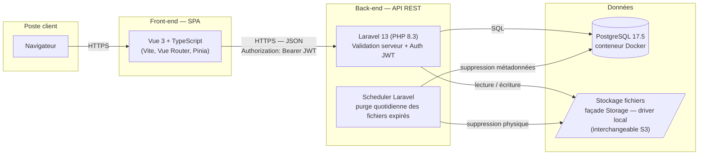

# Architecture de la solution — DataShare

## Légende et flux

| Élément | Rôle |
|---|---|
| SPA Vue 3 + TS | Interface utilisateur (maquettes Figma), validation côté client |
| API Laravel | Logique métier, validation côté serveur, émission/vérification JWT |
| PostgreSQL | Métadonnées : utilisateurs, fichiers (token, expiration, protection) |
| Stockage fichiers | Contenu binaire, noms physiques aléatoires, hors racine web |
| Scheduler | Tâche planifiée quotidienne : suppression des fichiers expirés (métadonnées + physique) |

Sécurisation des échanges : HTTPS de bout en bout, JWT en en-tête `Authorization`
sur les routes protégées, validation des entrées côté client **et** serveur,
mots de passe (comptes et fichiers) hachés en bcrypt.

## Décisions de conception

- **SPA et API séparées plutôt que rendu serveur (Blade/Inertia)** : les
  maquettes décrivent un parcours à état — barre de progression d'upload,
  compte à rebours d'expiration, copie du lien — qui suppose de toute façon du
  JavaScript côté client. Une API REST rend en outre le back-end réutilisable
  par un autre client (mobile, CLI) sans refonte.
- **Authentification par JWT plutôt que session à cookie** : l'API reste sans
  état, donc horizontalement extensible, et le front est libre de son
  hébergement (pas de contrainte de domaine partagé pour le cookie). Le prix à
  payer : un jeton émis ne peut pas être révoqué avant son échéance — d'où une
  durée de vie courte, et l'obligation de vérifier l'existence du compte à
  chaque requête plutôt que de faire confiance au seul contenu du jeton.
- **Fichiers hors de la racine web, servis par un contrôleur** : c'est ce qui
  rend les règles métier incontournables. Un fichier accessible par URL directe
  contournerait la vérification d'expiration et le mot de passe de partage
  (US09) ; en passant systématiquement par l'application, un lien reste
  inopérant dès `expires_at` dépassé, avant même toute suppression.
- **Façade `Storage` plutôt qu'un accès direct au système de fichiers** :
  le driver `local` suffit au prototype, et le passage à S3 se fait par
  configuration, sans toucher au code métier. Le même contrat couvre l'écriture,
  la lecture en flux et la suppression, ce dont la purge a besoin.
- **Validation dupliquée client et serveur** : côté client pour le retour
  immédiat exigé par les maquettes, côté serveur parce que c'est la seule
  barrière réelle — l'API est atteignable sans passer par la SPA.
- **bcrypt pour les deux usages de mot de passe** : algorithme à coût
  paramétrable, hachage natif de Laravel, et aucun besoin de déchiffrement
  (comptes comme partages ne font que vérifier).

## Ce que garantit — et ne garantit pas — le scheduler

L'expiration et la purge sont deux mécanismes distincts, volontairement
découplés :

- **L'inaccessibilité est immédiate** et ne dépend pas du scheduler : elle
  découle du test `expires_at < now()` à chaque requête. Un lien cesse de
  fonctionner à la seconde près.
- **L'effacement physique est différé** au passage quotidien suivant. Un
  fichier expiré peut donc subsister sur le disque jusqu'à 24 h. Ce n'est pas
  une garantie d'effacement immédiat, et il faut l'assumer comme tel si une
  exigence de rétention plus stricte apparaît.

**Ordre des suppressions** : contenu physique d'abord, ligne en base ensuite.
Si la seconde étape échoue, le passage suivant retrouve la ligne expirée et
retente — la suppression d'un fichier déjà absent étant sans effet, la tâche
est rejouable sans dommage. L'ordre inverse laisserait un fichier orphelin sur
le disque, que plus aucune ligne ne référence et qu'aucun passage ne
retrouverait.

**Prérequis d'exploitation** : le scheduler Laravel suppose une entrée cron
appelant `schedule:run` chaque minute. Sans elle, aucune purge n'a lieu — les
liens expirent malgré tout, mais le disque ne se libère jamais.

## Périmètre du prototype

En développement, seul PostgreSQL est conteneurisé (`compose.yaml`) ; le
back-end tourne via `php artisan serve` et le front via Vite. HTTPS relève donc
de l'environnement de déploiement, pas du poste de développement.

L'authentification JWT est une décision d'architecture : à ce stade, aucun
paquet correspondant n'est encore installé côté back-end.
