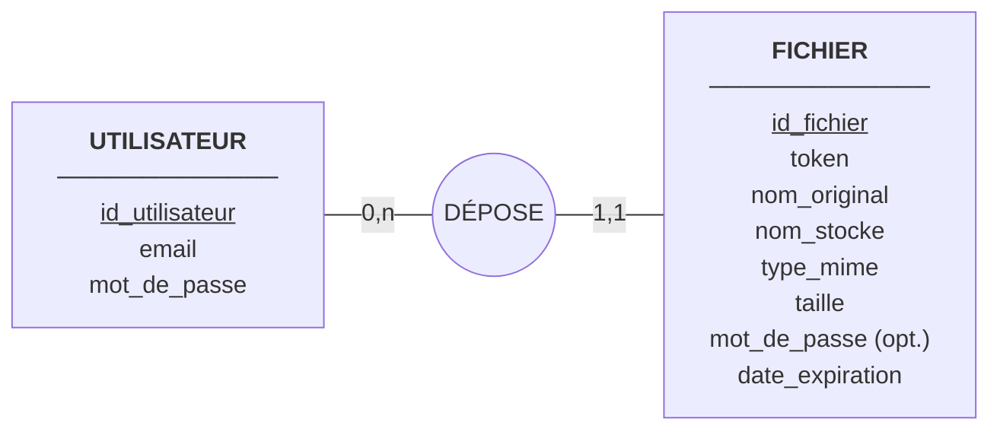
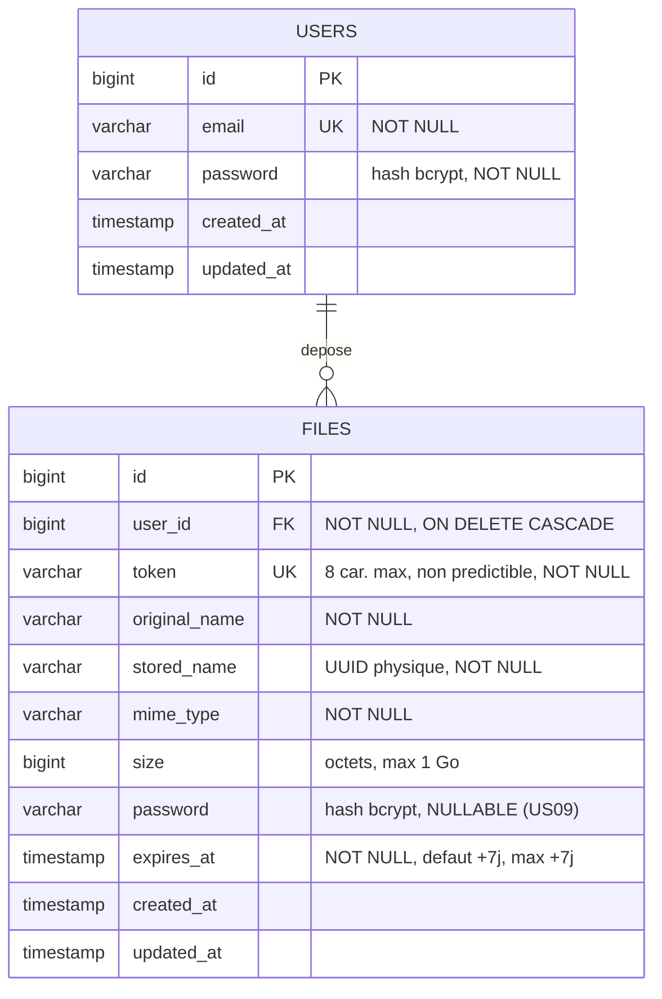

# Modèle de données — DataShare

## MCD (formalisme Merise)

Lecture : un UTILISATEUR dépose 0 à n FICHIERS ; un FICHIER est déposé par
exactement 1 UTILISATEUR (upload anonyme US07 hors périmètre du prototype).

**Identifiants** (soulignés) : `id_utilisateur` et `id_fichier` sont des
identifiants techniques. `email` et `token` sont des **identifiants candidats**
— uniques et non nuls — mais ne servent pas de clé primaire : `email` est
modifiable par l'utilisateur, et `token` est exposé publiquement dans les liens
de partage. Une clé primaire technique évite de propager ces contraintes
métier dans les clés étrangères.

## MLD (schéma relationnel)

## Contraintes et index

| Objet | Type | Justification |
|---|---|---|
| `users.email` | UNIQUE | Identifiant de connexion (US01) |
| `files.token` | UNIQUE | Résolution du lien public en une requête (US02) |
| `files.user_id` | FK → `users.id`, `ON DELETE CASCADE` | La suppression d'un compte retire ses fichiers |
| `files.expires_at` | INDEX | Balayage quotidien des fichiers expirés (US10) |
| `files.user_id` | INDEX | Listing « mes fichiers », trié par `created_at` |

`ON DELETE CASCADE` ne couvre que les métadonnées : la suppression physique des
fichiers reste à la charge du code applicatif (événement de modèle ou service
dédié), le SGBD n'ayant aucune prise sur le système de fichiers.

## Décisions de conception

- **`token` distinct de `id`** : le lien public utilise un identifiant court
  non prédictible (US02) — jamais la clé auto-incrémentée.
- **`stored_name` distinct de `original_name`** : nom physique aléatoire sur
  disque (anti-collision, anti-traversée de chemin) ; le nom d'origine ne sert
  qu'à l'affichage et au téléchargement.
- **État « expiré » calculé** (`expires_at < now()`), aucune colonne d'état :
  une seule source de vérité ; la purge quotidienne supprime ensuite
  physiquement (US10).
- **Pas de soft delete** : suppression irréversible exigée (US06).
- **Pas de table `tags`** : US08 optionnelle, absente des maquettes — exclue.
- **`user_id NOT NULL`** : upload réservé aux utilisateurs authentifiés
  (US01) ; US07 (anonyme) explicitement non exigée pour le prototype.
- **`size` en `bigint`** : la limite de 1 Go tient dans un `int` signé, mais
  `bigint` évite une migration si le plafond évolue.
- **Deux colonnes `password` sans lien** : celle de `users` authentifie un
  compte, celle de `files` protège un partage (US09) — durées de vie et
  politiques de réinitialisation distinctes, aucune mutualisation possible.
